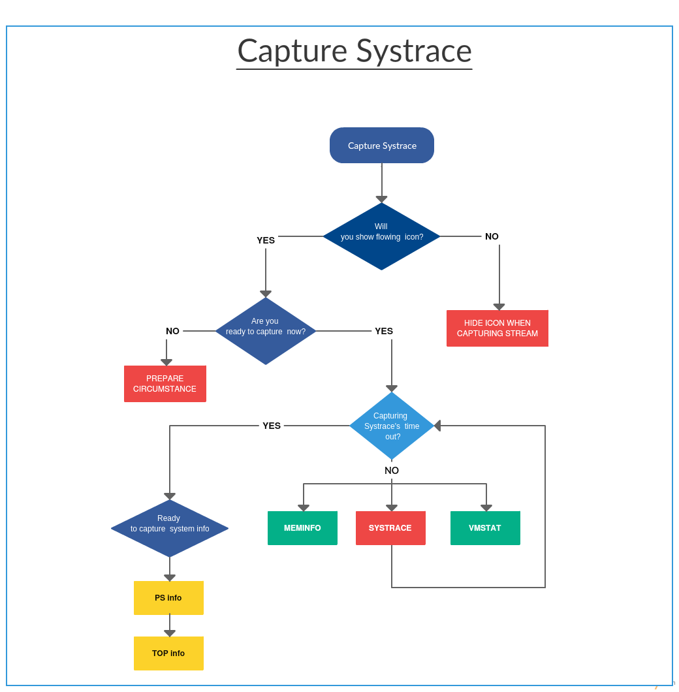
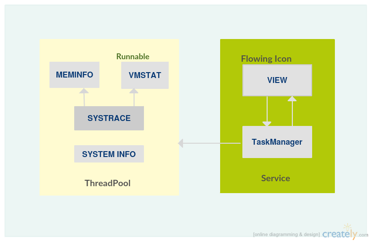

# SystraceTool

This project aims to provide a Systrace tool in the Android, so that user can directly catch the Systrace file with app.
Please note that it only based on **sdkVersion:20 or above** which can use atrace command for Android.

## Features
	* can set time interval of the systrace
	* auto catch top info after systrace
	* can change visibility of the icon in the menu

## Summary
This app focuses on capturing systrace data from handset directly, along with other system information, such as vmstat, meminfo, ps, top info.
The below picture depicts the entire processing flow:

First of all, when user touch floating icon to ready for capturing systrace, the app starts off several new threads to get systrace, vmstat, meminfo information synchronously; and then, it starts off other thread to catch ps and top information after finished all the work mentioned as above.
While all the threads run out, the floating icon change its status from freezing to original to mean that all the processes finished and the information have been attained.

## Code Structure

The code structure seems like MVP pattern, in which TaskManager acts like Presenter: it is the overall controller that creates and connects views and threads.
All the threads in running in the mWorkThreadPool, mCommandWorkQueue is a queue of Runnables for the mWorkThreadPool.

## License

    Copyright 2015, 2016 Carol Cao

    Licensed under the Apache License, Version 2.0 (the "License");
    you may not use this file except in compliance with the License.
    You may obtain a copy of the License at

       http://www.apache.org/licenses/LICENSE-2.0

    Unless required by applicable law or agreed to in writing, software
    distributed under the License is distributed on an "AS IS" BASIS,
    WITHOUT WARRANTIES OR CONDITIONS OF ANY KIND, either express or implied.
    See the License for the specific language governing permissions and
    limitations under the License.
